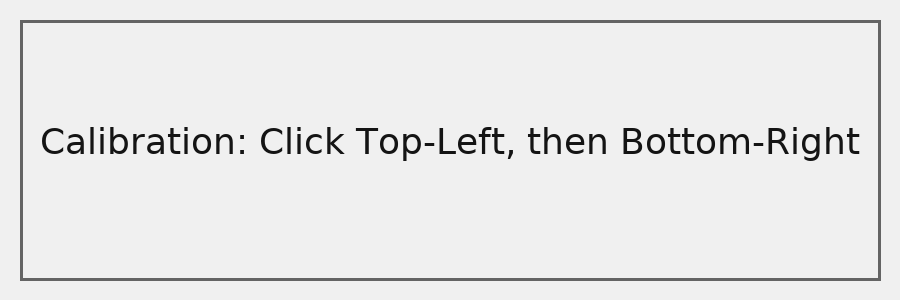
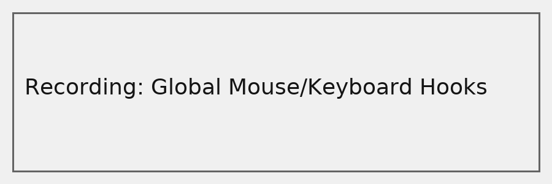
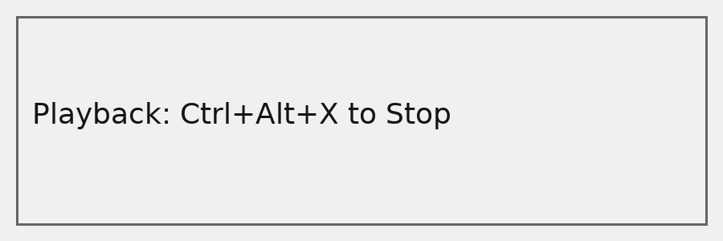

# 🖱️ UITestAutomation — Smart UI Recorder & Player (WPF / .NET 7)

A lightweight and open-source **UI automation tool** that records and replays **mouse and keyboard** actions with **DPI-aware precision** and **calibration support**.  
Ideal for **testing**, **workflow automation**, and **desktop app QA**.

> ⚠️ **Disclaimer**  
> This software is for testing, automation, and productivity use only.  
> DO NOT use it to violate Terms of Service of any online game or application.  
> The author assumes no responsibility for misuse.

---

## ✨ Features

✅ Record & replay mouse + keyboard actions  
✅ Adjustable delay between actions (default: 1000 ms)  
✅ JSON-based macro format (easy to edit)  
✅ Supports **Per-Monitor DPI** and **multi-monitor**  
✅ Built-in **Calibration Mode** to fix coordinate drift  
✅ Optional **ADB tap / keyevent** support (for Android emulators)  
✅ Global hotkey: **Ctrl + Alt + X** → stop playback instantly  
✅ Open Source (MIT License)

---

## 🖥️ Screenshots
| Calibration | Recording | Playback |
|--------------|------------|-----------|
|  |  |  |

---

## ⚙️ How to Use

### ① Record
1. Click **Record**
2. Enter target window title (e.g. `Chrome`, `Mabinogi`, `BlueStacks`)
3. Perform mouse/keyboard actions
4. Press **ESC** or click **Stop Record**

💾 Actions are displayed in the right panel and can be saved as `.json`.

---

### ② Calibrate (Fix mouse offset!)
When your emulator or game window shows **offset clicks**, use calibration mode:

1. Click **Start Calibration**
2. Click once on **the top-left** corner of the game content
3. Click again on **the bottom-right** corner of the game content
4. Calibration values will appear on the left panel  
   (Offset X, Offset Y, Content W, Content H)

✅ From now on, every recorded or replayed coordinate is automatically mapped to that calibrated region.

If you move or resize the game window, **re-run calibration**.

---

### ③ Playback

Click **Play** → Macro will replay with timing from JSON.  
- Stop anytime: **Ctrl + Alt + X**  
- Adjust delays in JSON (`"DelayMs": 1000` → any value)

If you checked **Use ADB for playback**:
- Mouse clicks are converted into `adb shell input tap x y`
- Key events (Enter, Backspace, Tab…) become `adb shell input keyevent <code>`

---

## 💾 JSON Example

```json
{
  "Calibration": {
    "OffsetX": 80,
    "OffsetY": 120,
    "ContentW": 1000,
    "ContentH": 600
  },
  "Events": [
    {
      "Type": "MouseClick",
      "X": 300,
      "Y": 200,
      "DelayMs": 800
    },
    {
      "Type": "KeyDown",
      "VkCode": 13,
      "DelayMs": 200
    },
    {
      "Type": "KeyUp",
      "VkCode": 13,
      "DelayMs": 200
    }
  ]
}
```

---

## 🧩 Calibration Details

Mouse offset issues are common on high-DPI or letterboxed windows.  
This tool fixes them by mapping coordinates:

```
ContentX = (RawX - OffsetX) / ContentW
ScreenX  = WinLeft + OffsetX + ContentX * ContentW
```

This ensures accurate clicks even when:
- Display scaling ≠ 100 %
- Game window has letterboxing
- Emulator renders inside a sub-viewport

---

## 🧱 Architecture

```
UITestAutomation/
├── MainWindow.xaml / .cs  ← UI logic + hook handler
├── App.xaml / .cs         ← DPI aware setup
├── Models (InputEvent, Calibration)
├── NativeMethods          ← Win32 APIs
└── LICENSE / README.md
```

---

## 🧰 Tech Stack

- **Language:** C# (.NET 7)
- **UI Framework:** WPF
- **Native API:** Win32 `SendInput`, `SetWindowsHookEx`
- **Serialization:** System.Text.Json
- **Build Tool:** MSBuild / Visual Studio

---

## 🧠 Notes

- Run both this app and the target app with the **same privilege** (Admin / Normal).  
- Multi-monitor setups are fully supported via **Virtual Screen Coordinates**.  
- JSON macros from older versions (array-only) remain compatible.

---

## 💡 Tips
- Use this to automate **repetitive test flows** (e.g., button click + input validation).
- Use calibration if coordinates drift on your emulator.
- Save different macros for each screen resolution.

---

## 🛠️ Build

```bash
dotnet restore
dotnet build -c Release
dotnet publish -r win-x64 -p:PublishSingleFile=true
```

The output `.exe` will be in `bin\Release\net7.0-windows\publish`.

---

## 🧾 License

This project is licensed under the [MIT License](LICENSE).  
You are free to use, modify, and distribute it under the same license.

---

## ☕ Support the Developer

If you found this project useful, consider buying me a coffee!

[](https://buymeacoffee.com/loganjung)

| Platform | Link |
|-----------|------|
| ☕ **Buy Me A Coffee** | [Click](https://buymeacoffee.com/loganjung)|

Your support helps me maintain and improve open-source tools like this!

---

## 🚀 Releases

Download the latest prebuilt version:

https://github.com/loganMongmu/UITestAutomation/releases

Each release includes:
- `UITestAutomation.exe`  
- Sample `example_macro.json`  
- Change log and hash

---

## ❤️ Contributing

Pull Requests are welcome!

1. Fork this repo  
2. Create a new branch (`feature/add-keyboard-support`)  
3. Commit your changes  
4. Submit a PR  

---

## ⭐ Star the Repo!

If this project helped you automate your work,  
please ⭐ **star the repository** and share it!

---

## 📬 Contact
For inquiries or suggestions:  
📧 calminglogan@gmail.com  
